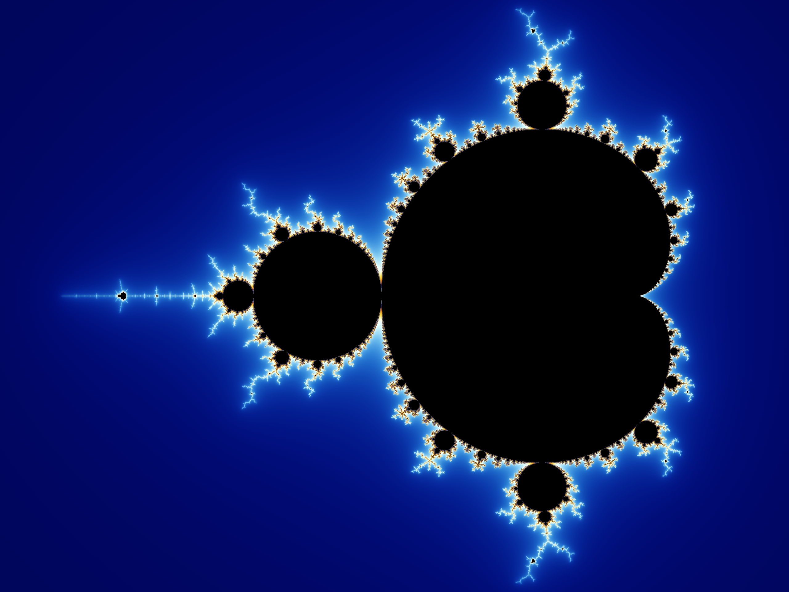

# N°69 - Mandelbrot Set

I've always wanted to generate a representation of the
[Mandelbrot Set](https://en.wikipedia.org/wiki/Mandelbrot_set) myself, and this
challenge is the perfect opportunity to do so! This project will be coded in
Rust, and it will be creating an image of the Mandelbrot Set in a `.png` file.


> Images credits: Wolfgang Beyer, for Wikipedia.

## Starting the challenge

I already knew this recurrence equation that leads to the creation of the 
wonderful Mandelbrot Set, first rendered in 1978 by Robert W. Brooks and Peter
Matelski in 1978 :

$z_{n+1}=z_n^2+c$, with $z_0=0$ and $c$ a complex number

But how exactly does it work, how can I use it in my program? Well, after doing
a bit of research on [Wikipedia](https://en.wikipedia.org/wiki/Mandelbrot_set) and reading [this](https://mathworld.wolfram.com/MandelbrotSet.html) very interesting article, I had a grasp of how this formula is used. 

First, we need to understand what is the Mandelbrot Set. As its name suggests,
this mathematical object is the set of complex numbers $c$ for which the
recurrence relation $z_n$ (defined above) doesn't diverge to infinity. This very
simple formula yields the amazing Mandelbrot Set fractal when plotted on a 2D 
plane, especially when accounting for the numbers of iterations it took for the
equation to diverge!

## Solving the challenge

### A way to render the result

I first needed a way to generate an image of the result. To do so, I added the
[`image` crate](https://docs.rs/image/0.24.6/image/) to my `Cargo.toml` and
imported it inside the `main.rs` file:

```rs
use image::{GrayAlphaImage, LumaA};
```

Because the rendered result was going to be in grayscale, I only imported
`LumaA` and `GrayAlphaImage`.

I then created an image `img` and added a loop to iterate through all the 
pixels of the image, because each pixel was going to represent a complex number:

```rs
let mut img = GrayAlphaImage::new(width, height);
for (x, y, pixel) in img.enumerate_pixels_mut() {
  *pixel = get_pixel(x, y, width, height);
}
```

I defined `width` and `height` of the image by first chosing the range of 
complex numbers I was going to plot. Because all the complex numbers $c$ of the 
Mandelbrot Set lie within (approximately) $-2+1.12i$ to $0.47-1.12i$, I declared 
a `RANGE` constant with the minimum and maximum `x` and `y` values (with `y` 
being the imaginary part of the complex plane):

```rs
const RANGE: ((f64, f64), (f64, f64)) = ((-2., 0.47), (1.12, -1.12));
```

To determine the size of the image based on those numbers, I first needed to chose a resolution for the image. I settled with 2048. The resolution corresponds to how many pixels to plot per unit (i.e. between 0 and 1, there would be 2048 pixels). I then declared the `width` and `height` based of the distance between each range and scaled it with the resolution:

```rs
const RESOLUTION: f64 = 2048.;

fn main() {
  // - Snip -
  let width = (((RANGE.0).0 - (RANGE.0).1).abs() * RESOLUTION).round() as u32;
  let height = (((RANGE.1).0 - (RANGE.1).1).abs() * RESOLUTION).round() as u32;
  // - Snip -
}
```

Now that I had an image with the right amount of pixels, with each of them representing a complex number, it was time to move on to the rendering!

### Rendering the Mandelbrot Set

I first defined a function `get_pixel` that would determine if a given complex 
number $c$ (determined from two givens `px` and `py` coordinated in the image) 
belonged to the set or not, and return a `LumaA` (transparent grayscale) pixel 
based on the numbers of iteration it took for $c$ to diverge. I then needed a 
way to represent a complex number inside my code. That's why I added the 
`num-complex` crate and imported it using the `use` keyword in the `main.rs` 
file. Inside the `get_pixel` function, I started by declaring three variables:

- `i`, mutable, to keep count of the numbers of iterations that happened before $z_n(c)$ bailed out.
- `z`, also mutable, which is basically the current $z_n$.
- `c`, the complex number represented at position `px` and `py` in the image.